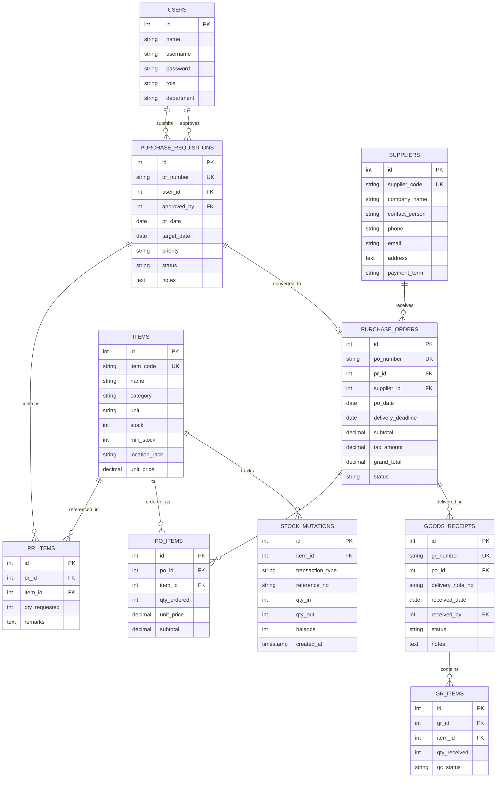

# Product Requirements Document (PRD)
## Sistem Informasi Purchasing & Pengendalian Inventaris Terintegrasi
### Studi Kasus: PT Nandya Karya Perkasa (Plant Komponen Otomotif)

---

## 1. Executive Summary & Latar Belakang

### 1.1 Profil Perusahaan
**PT Nandya Karya Perkasa (PT NKP)** adalah perusahaan manufaktur pemasok komponen otomotif roda dua dan roda empat terkemuka (rekanan PT Astra Honda Motor, dll). Operasional utama pabrik mencakup:
- *Metal Stamping & Pressing*
- *Dies & Mold Manufacturing & Maintenance*
- *Spot Welding & Sub-Assembly*
- *Plastic Injection Molding*

### 1.2 Masalah Saat Ini (*Pain Points*)
Berdasarkan observasi di lapangan (lantai produksi, gudang, dan divisi purchasing):
1. **Pengajuan Pembelian Konvensional:** Formulir permintaan barang (*Purchase Requisition* / PR) masih menggunakan kertas nota manual atau pesan chat personal, yang sering hilang atau lambat disetujui pimpinan.
2. **Ketiadaan Peringatan Stok Minimum (*Stockout Blindness*):** Kebutuhan suku cadang mesin press (seal hidrolik, sensor, oli) atau bahan pembantu (elektroda las, APD) seringkali baru disadari habis saat mesin breakdown, menyebabkan potensi *Line Stop* yang merugikan pabrik.
3. **Tracking Pesanan Lambat:** Staff pemohon tidak mengetahui apakah barang yang dimintanya sudah dipesan ke supplier, masih dalam perjalanan, atau sudah tiba di gudang.
4. **Pencatatan Ganda (*Double Entry*):** Staff gudang harus menginput ulang barang masuk secara manual ke buku stok fisik, terpisah dari data pembelian yang ada di purchasing.

### 1.3 Tujuan Proyek
Membangun web application **Sistem Informasi Purchasing & Inventaris Terintegrasi (SIP-NKP)** untuk:
- Mengotomatisasi siklus pengadaan: **PR → Approval → PO → Penerimaan (GR) → Auto-update Stok**.
- Memberikan notifikasi otomatis saat stok barang mencapai batas minimum (*Safety Stock Alert*).
- Menghasilkan dokumen cetak resmi berseri (Form PR, Purchase Order PDF ber-barcode, Bukti Penerimaan Barang).
- Menjadi objek tugas dan bahan laporan Praktik Kerja Lapangan (PKL) yang berbobot dan siap dipertanggungjawabkan di hadapan dewan penguji.

---

## 2. User Personas & Role-Based Access Control (RBAC)

Sistem membagi akses ke dalam 4 peran (*Role*) sesuai struktur organisasi pabrik:

| Role | Deskripsi Pengguna | Hak Akses Utama |
| :--- | :--- | :--- |
| **Requester (Staff / Teknisi)** | Operator gudang atau teknisi maintenance di lantai produksi. | - Melihat stok katalog barang - Membuat form pengajuan PR (*Purchase Requisition*) - Memantau status approval dan pengiriman barang yang diajukannya |
| **Approver (SPV / Manager)** | Kepala Bagian / Supervisor divisi terkait. | - Dashboard verifikasi pengajuan PR - Tombol *Approve* atau *Reject* disertai catatan alasan - Monitoring anggaran bulanan departemen |
| **Purchasing Officer** | Staf pengadaan divisi Purchasing PT NKP. | - Mengelola Master Vendor / Supplier - Mengubah PR yang disetujui menjadi PO (*Purchase Order*) - Menentukan harga, termin pembayaran (TOP), & estimasi kirim - Cetak dokumen resmi PO (PDF ber-barcode & stempel resmi) |
| **Warehouse (Penerimaan/GR)** | Petugas gudang penerimaan barang masuk (*Receiving*). | - Mencocokkan surat jalan supplier dengan nomor PO di sistem - Input verifikasi kuantitas fisik & status QC (*Pass/Reject*) - Tombol *Confirm Goods Receipt* (otomatis menambah stok barang) |
| **Administrator / IT** | Siswa PKL / IT Support. | - Manajemen akun pengguna (User & Role) - Master data kategori & barang - Backup data & activity log audit |

---

## 3. Fitur Utama & Kebutuhan Fungsional (Epics)

### EPIC 1: Manajemen Master Data
- **Master Barang (Items/Spareparts):** Kode barang (SKU unik, misal: `SPR-PRS-001`), nama barang, kategori (Mechanical, Electrical, Consumable, Raw Material, APD), spesifikasi teknik, lokasi rak gudang, satuan (Pcs, Box, Liter, Roll), stok saat ini, dan nilai stok minimum (*Safety Stock*).
- **Master Supplier (Vendor):** Kode vendor (misal: `VND-001`), nama PT/CV, nama sales/kontak person, nomor telepon, email, alamat kantor/pabrik, TOP (Term of Payment: Cash, Net 30, Net 60).
- **Master Departemen:** Stamping Press, Welding, Tooling/Dies, Maintenance, Quality Control, Logistik.

### EPIC 2: Modul Purchase Requisition (PR - Permintaan Pembelian)
- Pemohon memilih barang dari katalog yang stoknya di bawah minimum atau kebutuhan khusus.
- Input: Tanggal dibutuhkan (*Target Date*), urgensi (Normal / Urgent), keterangan alasan pemakaian (misal: *Penggantian Seal Silinder Mesin Press Aida 250T*).
- Status PR: `Draft`, `Submitted`, `Approved`, `Rejected`, `PO Created`.

### EPIC 3: Modul Approval & Workflow
- Notifikasi di dashboard supervisor ketika ada PR baru yang butuh persetujuan.
- Supervisor dapat melihat detail barang yang diminta, riwayat pemakaian sebelumnya, dan justifikasi biaya.
- Aksi: **Setujui** (langsung diteruskan ke Purchasing) atau **Tolak** (wajib mengisi alasan penolakan).

### EPIC 4: Modul Purchase Order (PO - Surat Pesanan Resmi)
- Purchasing melihat daftar PR yang berstatus `Approved`.
- Purchasing memilih supplier rekanan untuk setiap item pesanan.
- Sistem meng-generate nomor PO otomatis berurutan: `PO/NKP/YYYY/MM/XXXX`.
- Kalkulasi otomatis: Subtotal, diskon, PPN 11%, dan Grand Total.
- Fitur cetak dokumen PDF standar industri: Header logo PT Nandya Karya Perkasa, alamat plant Cileungsi Bogor, tabel barang, klausul syarat pengiriman, dan tanda tangan digital/cap basah.

### EPIC 5: Modul Goods Receipt (GR - Penerimaan Barang Datang)
- Saat supplier mengantar barang ke gudang PT NKP, petugas gudang mencari data berdasarkan **Nomor PO**.
- Petugas menginput nomor Surat Jalan dari supplier dan jumlah fisik yang diterima.
- Pengecekan status: `Full Receipt` (selesai) atau `Partial Receipt` (baru dikirim sebagian).
- **Trigering Auto-Update Stok:** Setiap kali GR disimpan, stok barang di tabel `items` langsung bertambah secara otomatis, dan riwayat mutasi stok tercatat (*Stock Card Ledger*).

### EPIC 6: Dashboard & Executive Reporting
- **Statistik Cepat (KPI Cards):**
  - Total Pengajuan PR Bulan Ini.
  - Jumlah PO Aktif (Sedang diproses vendor).
  - Peringatan Stok Kritis (Barang di bawah *Safety Stock*).
  - Nilai Pengeluaran Pengadaan (*Total Spend*).
- **Tabel Peringatan Dini:** Daftar barang yang wajib segera di-PO agar mesin tidak mati.
- **Export Laporan:** Cetak rekap pengadaan per periode, per supplier, atau per departemen ke format Excel/PDF.

---

## 4. Entity Relationship & Skema Basis Data

---

## 5. Non-Functional Requirements & Security

1. **Keamanan Data:**
   - Password terenkripsi (*Bcrypt / Hash*).
   - Validasi sesi multi-level (Role Requester tidak bisa membuka halaman approval atau penerbitan PO).
   - Proteksi SQL Injection & XSS (Prepared Statements PDO).
2. **Performa & Kompatibilitas:**
   - Ringan, waktu muat halaman < 1 detik di lingkungan intranet pabrik / localhost Laragon.
   - Desain responsif (bisa dibuka via laptop admin maupun tablet/HP staf di lantai produksi).
3. **Pencetakan Dokumen Fisik:**
   - Tata letak cetak (*Print CSS / PDF engine*) disesuaikan dengan ukuran standar kertas A4 pabrik (lengkap dengan garis kop surat PT Nandya Karya Perkasa, nomor dokumen ISO, dan kotak tanda tangan 3 pihak: Dibuat, Diperiksa, Disetujui).

---

## 6. Target Penyelesaian untuk Laporan PKL

| Fase | Target Luaran (*Deliverables*) |
| :--- | :--- |
| **Minggu 1** | PRD, Skema Database MySQL, Setup Lingkungan Lokal Laragon |
| **Minggu 2** | Antarmuka Dashboard Modern, Modul Master Data Barang & Supplier |
| **Minggu 3** | Modul Transaksi Inti: Form PR, Sistem Approval, & Penerbitan PO PDF |
| **Minggu 4** | Modul Goods Receipt (Penerimaan Barang) & Sinkronisasi Stok Otomatis |
| **Minggu 5** | Pengujian Aplikasi, Pembuatan Tangkapan Layar untuk Bab 4 Laporan PKL |
