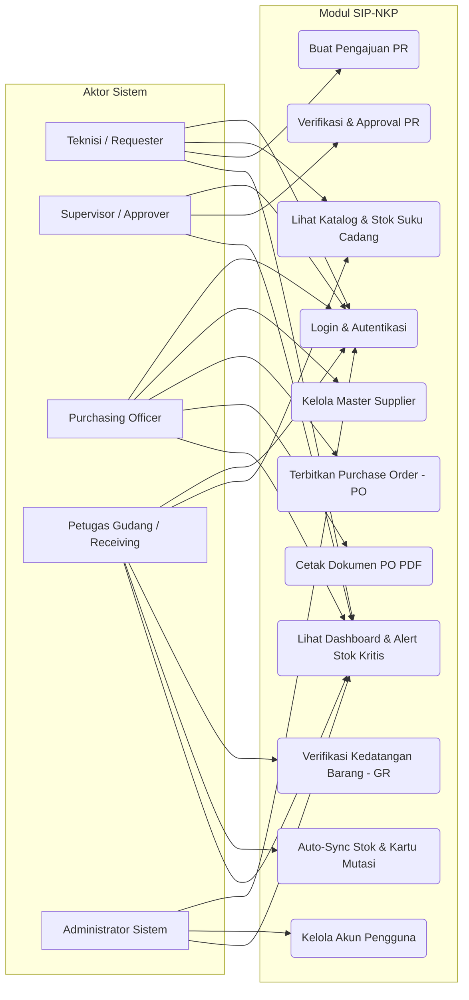
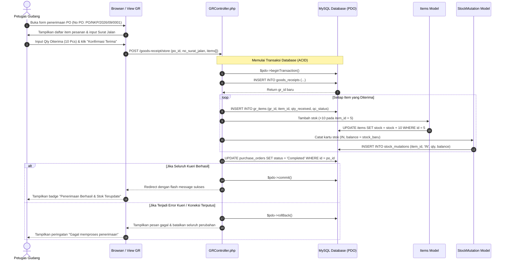

# SYSTEM_WORKFLOW.md - Diagram Alur Sistem & UML
## Proyek: SIP-NKP (Sistem Informasi Purchasing & Inventaris PT Nandya Karya Perkasa)

Dokumen ini berisi pemodelan visual sistem menggunakan diagram standar industri (UML Use Case, Activity Diagram, dan Sequence Diagram) yang dapat langsung disalin ke dalam **Bab 3 (Perancangan Sistem)** pada Laporan PKL.

---

## 1. Use Case Diagram

Diagram ini mendefinisikan interaksi antara aktor (pengguna sistem) dengan fungsi-fungsi utama yang disediakan oleh aplikasi SIP-NKP.

---

## 2. Activity Diagram (Alur Proses Pengadaan)

Diagram aktivitas berikut menggambarkan aliran kerja lengkap sejak stok barang menipis hingga barang diterima dan stok gudang bertambah.

```mermaid
stateDiagram-v2
    [*] --> CekKebutuhan: Teknisi mendapati stok menipis / butuh part baru
    CekKebutuhan --> BuatPR: Buka form PR di web
    BuatPR --> SubmitPR: Input barang, kuantitas, urgensi & alasan
    SubmitPR --> MenungguApproval: Dokumen PR berstatus 'Pending'
    
    state "Verifikasi Supervisor" as SPV_Check {
        MenungguApproval --> ReviewSPV: SPV cek detail & urgensi
        ReviewSPV --> Evaluasi: Layak disetujui?
        Evaluasi --> Ditolak: Tidak (Input alasan reject)
        Evaluasi --> Disetujui: Ya (Klik tombol Approve)
    }

    Ditolak --> [*]: Notifikasi kembali ke pemohon
    
    Disetujui --> NotifPurchasing: PR masuk antrean Purchasing
    
    state "Proses Purchasing" as PUR_Process {
        NotifPurchasing --> PilihVendor: Pilih supplier rekanan
        PilihVendor --> IsiHarga: Input harga, tempo bayar, lead time
        IsiHarga --> GeneratePO: Terbitkan Nomor PO Resmi
        GeneratePO --> CetakPDF: Download/Print Dokumen PO bertanda tangan
    }
    
    CetakPDF --> KirimSupplier: Kirim berkas PO ke email/sales vendor
    KirimSupplier --> Pengiriman: Vendor memproses & kirim barang ke pabrik
    
    state "Penerimaan Gudang (Receiving Dock)" as GR_Process {
        Pengiriman --> TrukDatang: Truk vendor tiba membawa Surat Jalan
        TrukDatang --> CariPO: Petugas gudang cari No PO di sistem
        CariPO --> CekFisikQC: Inspeksi fisik barang & uji QC
        CekFisikQC --> InputGR: Input No Surat Jalan & kuantitas diterima
        InputGR --> SimpanGR: Klik Konfirmasi Goods Receipt
    }

    state "Automasi Database" as DB_Auto {
        SimpanGR --> TambahStok: Tambahkan nilai stock di tabel items
        TambahStok --> CatatMutasi: Buat baris baru di stock_mutations (IN)
        CatatMutasi --> TutupPO: Ubah status PO menjadi 'Completed'
    }

    TutupPO --> [*]: Siklus Pengadaan Selesai Sempurna
```

---

## 3. Sequence Diagram (Konfirmasi Penerimaan Barang & Sinkronisasi Stok)

Diagram ini menggambarkan interaksi teknis antar-objek (Petugas Gudang, Web Controller, Database Transaction, dan Model Data) pada saat proses Goods Receipt.

---

## 4. Standar Operasional Prosedur (SOP) PT Nandya Karya Perkasa

Berikut narasi SOP resmi yang melengkapi diagram di atas untuk dicantumkan di laporan:

1. **SOP-NKP-PUR-01 (Pengajuan Kebutuhan Barang):**
   - Setiap permintaan barang di luar persediaan rutin wajib diajukan minimal **7 hari kalender** sebelum tanggal kebutuhan di lini produksi, kecuali dalam kondisi mesin *Breakdown (Urgent)*.
2. **SOP-NKP-PUR-02 (Otorisasi Pembelian):**
   - Pembelian di bawah Rp 10.000.000,- wajib disetujui oleh Supervisor Bagian.
   - Pembelian di atas Rp 10.000.000,- wajib mendapatkan verifikasi tambahan dari Plant Manager.
3. **SOP-NKP-WHS-01 (Penerimaan dan Karantina Barang):**
   - Barang yang tiba di *Receiving Dock* wajib dicocokkan antara fisik barang, Surat Jalan Supplier, dan dokumen Purchase Order yang terdaftar pada sistem SIP-NKP.
   - Barang yang tidak lolos uji QC (*Reject*) tidak dimasukkan ke dalam stok aktif dan langsung diterbitkan nota pengembalian (*Return Notice*).
